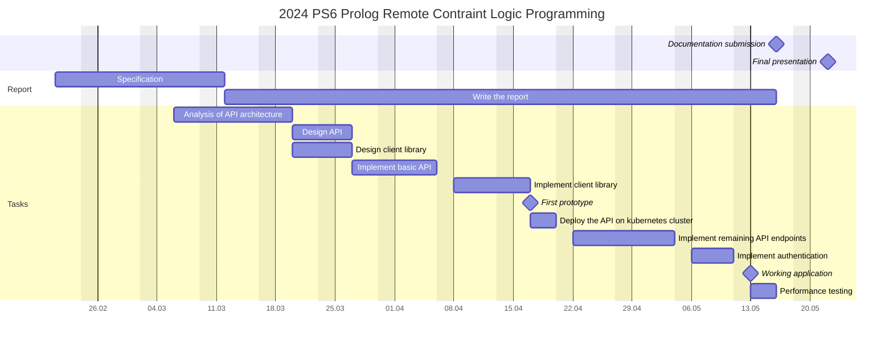

# Conversion

```sh
mmdc -i diagrams.md -o out/diagram.png -s 3
```

# Diagrams

## Planning


```mermaid
---
config:
  theme: default
  gantt:
    useWidth: 1200
---
gantt
    title 2024 PS6 Prolog Remote Contraint Logic Programming
    dateFormat DD.MM.YYYY
    axisFormat %d.%m
    tickInterval 1week
    weekday monday
    todayMarker off
    excludes weekends

    Documentation submission  : milestone, m1, 16.05.2024, 0h
    Final presentation        : milestone, m2, 22.05.2024, 4h

    section Report
        Specification    : d1, 21.02.2024, 14d
        Write the report :                 47d
    section Tasks
        Analysis of API architecture         : a1,        06.03.2024, 10d
        Design API                           :                        5d
        Design client library                : a2,        20.03.2024, 5d
        Implement basic API                  :                        8d
        Implement client library             :                        7d
        First prototype                      : milestone,             0h
        Deploy the API on kubernetes cluster : a3,        17.04.2024, 3d
        Implement remaining API endpoints    :                        10d
        Implement authentication             :                        5d
        Working application                  : milestone,             0h
        Performance testing                  :                        3d
```